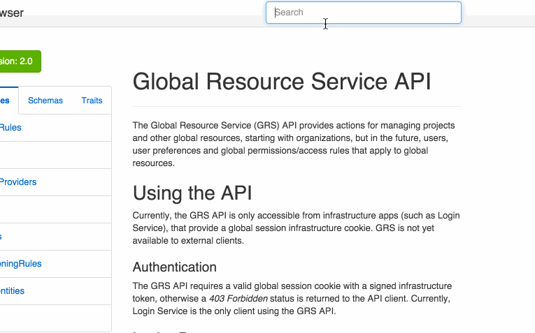

# Praxis Docs Search

This plugin for Praxis adds the capability to search the doc browser.



## Usage

Add this to your gemfile:

```ruby
gem 'praxis-docs-search'
```

In your `config.ru` add it to the Praxis Bootloader:

```ruby
application.bootloader.use Praxis::DocsSearch
```

Finally if you would like to use the default styling, add this to your `docs/styles.scss`:

```scss
@import "praxis-docs-search.scss";
```

If you are using your own navbar, you can include the search form anywhere by using
the `<search-form></search-form>` element in a custom template.

## Authors

Jakub Hampl @gampleman

MIT LICENSE

(c) RightScale, Inc. 2015
